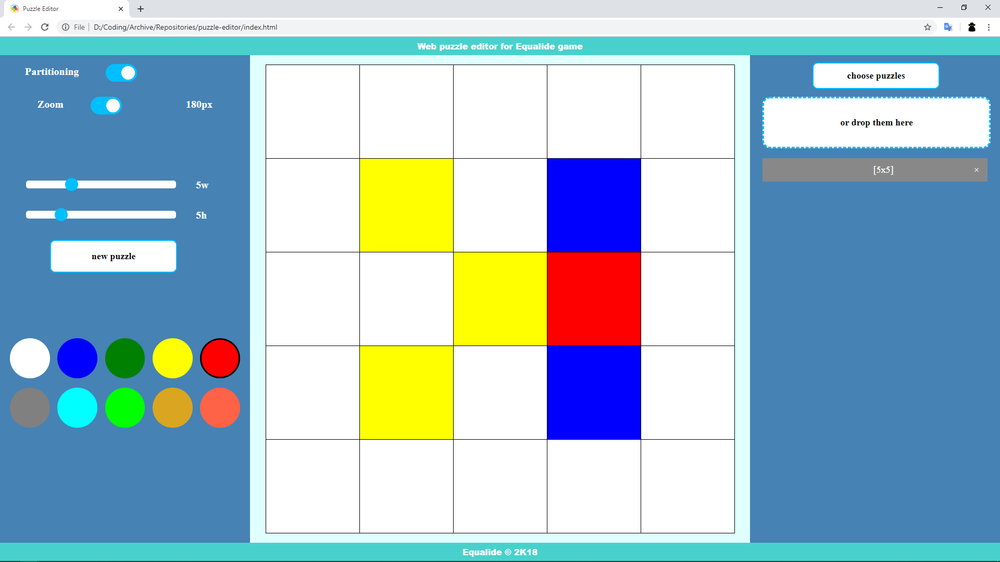

# Puzzle editor

Web page - a tool for convenient viewing of puzzle database of any size and pixel editing of puzzles.

## Features

- Loading puzzles from file (from 1 to ~2M+ puzzles in file)
- Support CR+LF/LF file endings
- Scaling of puzzle
- Turning of partition on/of
- Tab navigation through loaded puzzles (1K puzzles per tab)
- Creating of empty puzzle with given dimensions

## Puzzle format

- One puzzle under another through an empty string
- The end of the line is uniform throughout the file.

```txt
010
111
010

111
101
111
```

## Hotkeys

- **Left arrow** - previous puzzles tab
- **Right arrow** - next puzzles tab
- **Up arrow** - loading of previous puzzle
- **Down arrow** - loading of next puzzle
- **Delete** - delete selected puzzle
- **0** - select white color
- **1-9** - select color of primitive

## Screenshot


